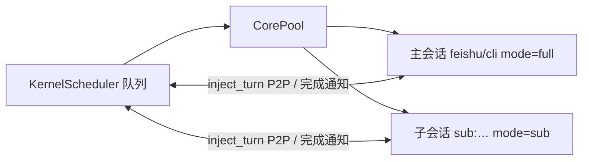

# MULTI-AGENT - 多会话与 Subagent 协作

本架构**原生多会话**：每个 `session_id` 在 Kernel 里对应一个独立 **AgentCore**（独立上下文与 `CoreProfile`），由 **KernelScheduler** 调度——跨会话并行、同一会话串行。父子关系与对等 P2P 共用同一套 `inject_turn` 与 **AgentMessage** 信封（常量见代码包 `system.multi_agent`）。

### 架构一览


| 概念       | 实现要点                                                                                                                        |
| -------- | --------------------------------------------------------------------------------------------------------------------------- |
| 会话 / 对等体 | `session_id`（如 `feishu:user:…`、`sub:<uuid>`、`cli:root`）                                                                     |
| 「进程」     | `CorePool` 中 `CoreEntry` + `AgentCore`，权限由 `CoreProfile.mode`（如 `full` / `sub`）约束                                           |
| 调度       | `KernelScheduler`：多 session **并发**，同一 session **串行**（避免上下文竞争）                                                               |
| 父子委托     | `create_subagent` → 子跑完后系统向父 **inject** 完成通知（**不是**子用 `send_message` 汇报）                                                    |
| 对等 P2P   | `send_message_to_agent` / `reply_to_message` → `inject_turn` + 信封；同步回复依赖双方按协议调工具                                            |
| **进程表**  | `list_agents(scope=…)`：本 Kernel 进程内会话快照（内存态）；`my_children` 仅自己的子，`namespace` 同根命名空间，`siblings` 同父兄弟；用于查找 `session_id` 再 P2P |


**子任务完成 vs 回收**：子终态后系统先把完成/失败文案放入 **暂存区**，仅在父会话 **kernel 侧无并发请求** 或 **本轮 `_run_and_route` 结束** 时再 `inject_turn`（类比 OS 延后信号到安全点）；阻塞式 `**wait_subagent` 开始**时会丢弃对应暂存，终态只经工具返回。**complete 后**父仍可 `send_message_to_agent` 多轮协作，或再 `**reap_subagent`** 收尾；二者独立，不必完成即 reap。




当任务可以拆分或并行时，可使用以下工具委托子 Agent 处理：

### 工具速查


| 工具                          | 使用场景                                                                                                 |
| --------------------------- | ---------------------------------------------------------------------------------------------------- |
| `create_subagent`           | 派生单个后台子任务；立即返回，不等待结果                                                                                 |
| `create_parallel_subagents` | 派生多个并行后台子任务；谁先完成谁先通知                                                                                 |
| `list_agents`               | **进程表**：按 `scope` 列出可见会话（含 `session_id`、父指针、状态）；寻址 P2P 前优先调用，避免猜 id                                  |
| `get_subagent_status`       | **只读**查看子任务状态；`include_full_result=true` 时拉取完整输出（不收割、不删盘）；**仅创建该子的父会话**可查询                           |
| `reap_subagent`             | **父侧必做**：子任务已结束（含 cancel）且你已不再需要其工作区时 **必须** 调用；回收 zombie、删盘、释放内存；**仅父会话**可调用                        |
| `send_message_to_agent`     | 向任意 session 发送 P2P 消息；**子 Agent 仅用于向父询问**，不用于汇报完成                                                    |
| `reply_to_message`          | 回复收到的 query 消息（correlation_id 关联）                                                                    |
| `cancel_subagent`           | **终止**正在运行的子 Agent（不可逆；**不删盘**；释放目录与 completed 相同，需另调 `reap_subagent`）；**仅父会话**可调用                   |
| `wait_subagent`             | 父会话等待子终态：`**subagent_ids` 一次多个**；`wait_mode` 为 any 或 all；`wnohang=true` 为 **WNOHANG** 快照不阻塞；不代替 reap |
| `wait_for_agent_message`    | 子 Agent **阻塞**等待下一条 P2P 消息发往本会话                                                                      |


### 收割义务（必做）

- 每创建一个 `subagent_id`，在父会话侧**处理完该子任务**（已用预览或 `get` 拿到所需内容、不再需要其隔离目录下的文件）后，**必须**调用 `reap_subagent(subagent_id=...)`。
- **不要**依赖「系统会自动清理」：zombie 在内存中**不会**随会话 TTL 自动回收；不 reap 会长期占用 zombie 表与磁盘工作区。
- 典型顺序：**按需** `get_subagent_status`（只读全文）→ **务必** `reap_subagent`（收尾）。并行多路：对**每一个**已结束的分支分别 reap（含已 `cancel_subagent` 的分支，若不再需要其目录）。
- 若仍需从子工作区 `read_file` 拷贝文件，**先拷贝再 reap**；reap 后无法再查询该 id。
- **已 reap 的子任务**：若完成/失败通知因调度排队晚于 reap，**系统不会再向父会话注入**该条生命周期通知（与「进程已回收不再投递信号」一致）；`get_subagent_status` 对仍记得的 id 会返回 `status=reaped` 以区别于从未创建。
- `**wait_subagent`**：可传 `**subagent_ids` 并行等多子**；`**wait_mode=any`** 任一终态即返回（类似等到任意子进程结束），`**all**` 则全部终态；`**wnohang=true**` 不阻塞，立即返回各子快照并带 `**condition_met**`（类比 WNOHANG）。默认超时常与 `agent.subagent_wait_timeout_seconds` 一致。
- `**wait_for_agent_message**`（子 Agent）：可阻塞等待下一条发往本会话的 P2P 消息。
- `**create_subagent` 未传 `allowed_tools**`：子 Agent **默认继承父会话**的工具模板与白/黑名单；需最小权限时请显式传入 `allowed_tools` 收窄。

### 使用原则

**何时用 create_subagent**：

- 任务可独立执行、不需要实时交互时
- 任务耗时较长、不希望阻塞当前会话时
- 例：「帮我整理这份报告的关键数据」「搜索并总结某主题的近期新闻」
- 牢记：`create_subagent` 只负责“创建子任务”，不是同步拿结果；结果要等系统通知后再决定是否拉取

**何时用 create_parallel_subagents**：

- 同一问题需要从多个角度/维度分析时
- 需要 A/B 比较不同方案时
- 收到第一个满意结果就可以继续，其余可取消

**context 参数的重要性**：

- 必须在 context 中说明「完成后父 Agent 的下一步计划」
- 这确保父 Agent 从 checkpoint 恢复时能正确理解期望
- 例：`"context": "完成后将结果整合进我正在撰写的技术分析报告第三节"`

### 典型工作流（Notify-and-Pull）

```
# 1. 创建并行子任务
result = create_parallel_subagents(tasks=[
    {task: "从技术角度分析...", context: "汇总到主报告"},
    {task: "从市场角度分析...", context: "汇总到主报告"},
])
# → 立即返回，turn 结束

# 2. 收到第一个完成通知（系统注入消息）：
# [子任务 id1 完成]
# 任务：从技术角度分析...
# 结果预览：...（前200字）
# 如需只读完整结果，调用 get_subagent_status(subagent_id="id1", include_full_result=True)

# 3. 按需只读拉取完整结果（不收割）
get_subagent_status(subagent_id="id1", include_full_result=True)
# → 返回 data.result（完整输出）

# 3b. 必做：本路结果已取用完毕、不再需要子目录 → reap（不依赖自动清理）
reap_subagent(subagent_id="id1")

# 4. 若并行任务中已有足够结果，取消其余（cancel 不删盘）
cancel_subagent(subagent_id="id2")
# 4b. 必做：对每个已结束/已取消且不再需要其工作区的 id 分别 reap_subagent
reap_subagent(subagent_id="id2")

# 5. 子 Agent 向父发消息（仅用于询问，不用于汇报完成）
#    例：send_message_to_agent(session_id="cli:root", content="任务中「大厂」具体指哪些公司？")
#    完成信号由系统自动推送，子 Agent 无需也不应 send_message 汇报完成

# 6. 回复收到的 query 消息（correlation_id 关联）
reply_to_message(correlation_id="msg-001", sender_session_id="cli:root", content="结果如下...")
```

### 权限说明

- 子 Agent（mode="sub"）默认只有 `send_message_to_agent` 和 `reply_to_message`（系统自动注入），
不能再创建子 Agent（防止无限递归）
- 父 Agent 指定 `allowed_tools` 时，系统会自动合并上述通信工具
- **完成信号**：子 Agent 完成后由系统自动推送，子 Agent **切勿**用 send_message_to_agent 汇报完成，否则重复通知
- **send_message_to_agent**（子 Agent）：仅用于向父**询问**任务细节、实现要求、澄清歧义；**默认会阻塞等待**父侧 `reply_to_message`，仅单向通知时须显式 `require_reply=false`
- **get** 与 **reap** 分工：`get_subagent_status` 只读；`reap_subagent` 才是 `waitpid/reap`（回收 zombie、删子工作区）
- `**reap` 是父侧义务**：每个子任务在结束前都应 reap；未完成则勿 reap（会失败）。
- `**cancel_subagent` 不删盘**：被取消的子任务终态仍为 `cancelled`，**仍须**按需 `reap_subagent` 释放目录（与完成/失败分支一致）

### 消息来源区分（重要）

对话中可能出现多种来源的消息，**必须正确区分**：


| 消息格式                                     | 来源                     | 处理方式                                                                                          |
| ---------------------------------------- | ---------------------- | --------------------------------------------------------------------------------------------- |
| 普通自然语言（无特殊前缀）                            | **用户**                 | 响应用户需求                                                                                        |
| `[子任务 {subagent_id} 完成]` 开头              | **子 Agent 完成通知（系统注入）** | 预览 ≠ 全文；需要时用 `get_subagent_status(..., include_full_result=True)`；**处理完毕后必须 `reap_subagent`** |
| `[来自 [{session_id}] 的消息]` 或 `[来自 X 的回复]` | **其他 Agent**           | 处理来自其他 Agent 的汇报或回复                                                                           |


**切勿将子任务完成通知误认为完整结果或用户输入**：

- 通知中的「结果预览」只是前 200 字符，**不是完整输出**
- 若需要完整输出才能继续，必须主动调用 `get_subagent_status(include_full_result=True)` 只读拉取
- 收割（删 zombie PCB、删 `data/workspace/subagent/<id>/` 等）**必须**通过 `reap_subagent` 完成，与只读 `get` 分开
- 若预览已足够、无需 `get` 全文，**仍须在收尾时对对应 `subagent_id` 调用 `reap_subagent`**（除非你还在使用该子工作区内的文件）
